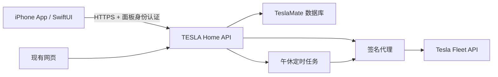

# TESLA Home iPhone App 方案（仅规划）

可以开发 iPhone App，继续使用现有服务器、TeslaMate 数据库、Fleet 授权与签名代理。推荐 SwiftUI 原生 App 负责页面和交互，后端负责 Tesla 凭据、车辆指令、数据查询和定时任务。本次没有创建或发布 iOS 工程。

## 第一版范围

- 登录、当前车辆、电量、车内温度、上报时间。
- 原生车辆控制页、弹窗调温、充电设置、哨兵、前后备箱和车窗操作。
- 午休模式的开始、提前结束、倒计时、关闭失败提示。
- 个人中心、控制授权状态；用系统授权浏览器完成 Tesla 登录，再回到 App。
- 行程和充电记录先做列表与简单图表，复杂分析页可后续逐步迁移。

## 可以复用与需要补充的部分

| 部分 | 方案 |
|---|---|
| 数据接口、Fleet 授权、签名代理 | 复用现有后端；不把 Tesla 密钥放进 App |
| 界面 | SwiftUI 重做，沿用当前配色、车辆模型布局和交互原则 |
| App 登录 | 第一阶段可使用现有 HTTPS 会话；正式版补充按设备撤销的会话管理，避免在 App 存储登录密码 |
| 本地保护 | 会话凭据放 Keychain；Face ID 可用于解锁本地敏感操作，服务器仍必须检查权限 |
| OAuth 回跳 | 补充面向 App 的授权流程，采用 ASWebAuthenticationSession 和已验证的回跳绑定；现有网页流程保留 |
| 通知 | 后端在午休结束或关闭失败后经 APNs 推送；通知中不含密钥、精确位置或完整 VIN |
| 午休计时 | 继续在服务器执行；App 只展示倒计时，不依赖 iOS 后台常驻 |

iOS 后台执行由系统调度，不能用手机上的普通定时器保证准时发出关闭车辆指令。Apple 建议按工作类型选择后台策略，因此服务器定时是本项目更合适的选择。[Apple 后台任务说明](https://developer.apple.com/documentation/backgroundtasks/choosing-background-strategies-for-your-app)

## 开发与分发

1. 先补充 App 会话、授权回跳和通知接口，编写接口契约与模拟数据。
2. 建立 SwiftUI 工程，完成登录、车辆模型、模块弹窗和午休功能。
3. 用模拟车辆验证全部指令，再由车主选择安全时机做实车验收。
4. 通过 TestFlight 进行个人/小范围测试，成熟后再考虑 App Store。

当前工作电脑为 Windows，iOS 原生编译、签名和发布需要 Mac/Xcode 环境或对应的 macOS 构建服务。App Store/TestFlight 分发需要 Apple Developer Program 及签名配置。[Apple 开发者注册](https://developer.apple.com/programs/enroll/)

若只供自己使用且希望立即在 iPhone 主屏打开，也可先做 PWA；但原生通知、系统授权交互、Face ID 等整体体验更适合 SwiftUI。仅将网站套入 WebView 不作为推荐的正式产品方向，仍需满足 Apple 对功能、质量和隐私的审核要求。[App Review Guidelines](https://developer.apple.com/app-store/review/guidelines/)

公开发布前还需要检查 Tesla 应用的使用范围、品牌素材授权、隐私政策与数据删除流程。现有个人服务器不能直接假设已经具备多租户隔离；若对外服务，应先增加车辆归属校验、用户隔离、审计及配额。本方案第一阶段按个人/家庭使用设计。

## 建议顺序

先稳定当前网页控制与午休流程，再做共享后端的原生 iPhone App。这样无需重新建设车辆接入，也便于网页和 App 同步看到同一份任务状态。
